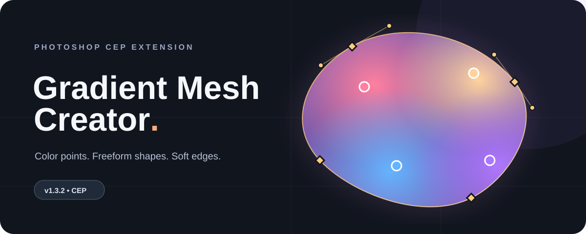

<div align="center">
  

  # Gradient Mesh Creator

  **Shape color freely, then bring it into Photoshop.**

  A lightweight CEP panel for building soft gradient meshes with independent color and outline controls.

  <p>
    
    
    
  </p>
</div>

## What you can make

| Shape the silhouette | Paint with points | Export your way |
| :--- | :--- | :--- |
| Drag distinct **gold diamond** outline points. Add or remove points and adjust Bézier handles for organic curves. | Drag **colored circles**, double-click the preview to add a color point, and set precise colors with a swatch or hex value. | Save a transparent PNG or add the rendered mesh as a Photoshop layer at your chosen dimensions. |

The preview updates as you edit. **Soft edge** feathers the silhouette, with transparent padding so the fade stays inside the exported image. The resulting Photoshop layer is raster artwork; edit the mesh in the panel and add another layer to make a new version.

## Quick start

1. Download the source and copy the `gradient-mesh-cep` folder to `%APPDATA%\Adobe\CEP\extensions\gradient-mesh-cep` on Windows. The `CSXS` directory should be directly inside it.
2. Because the source is unsigned, enable CEP debug mode for your Photoshop CEP runtime. For CEP 12, create a **String** value named `PlayerDebugMode` with value `1` in `HKEY_CURRENT_USER\Software\Adobe\CSXS.12`. Use the matching `CSXS.<version>` key if your Photoshop uses another CEP runtime.
3. Restart Photoshop. Open a document and choose **Window → Extensions (Legacy) → Gradient Mesh Creator**.

The manifest requests **CEP 9 or newer** and Photoshop host version **20 or newer**. The panel uses the Node.js runtime bundled with CEP and has no npm install step. To distribute a signed build, package it as a ZXP with Adobe CEP tooling.

## Make a mesh

1. Pick a **Shape** preset and **Color layout**. The shape and color systems remain independent when you change either preset.
2. Drag colored circles to move color points. Double-click inside the preview or choose **+ Color point** to add one. Select a point to use the color swatch, enter a `#RRGGBB` hex value, or sample a color from the preview. **Use Photoshop foreground** reads Photoshop's current foreground color; Photoshop's eyedropper can set it first.
3. Drag gold diamonds to reshape the boundary. Choose **+ Shape point** to add a point on the selected outline segment. Turn on **Smooth outline** and drag the small incoming and outgoing Bézier handles to tune the curve. Handles can travel beyond the preview edge. Opposite handles stay aligned in a straight tangent; hold **Alt** while dragging to adjust one independently.
4. Select either point type and press **Delete**, or choose **Delete selected**, to remove it. The mesh retains at least one color point and three shape points.
5. Adjust **Blend radius** and **Soft edge**. Enter the output width and height, then choose **Add as Photoshop layer** or **Download PNG**.

Each output dimension can be **1–8192 px**, with a maximum of **16 million pixels** total. **Use active document size** fills the width and height fields only when clicked. For Photoshop layers, **Fit imported layer inside document** scales down and centers a layer only when needed to keep it visible; turn it off to preserve the entered pixel size.

## Project map

```text
gradient-mesh-cep/
├── CSXS/manifest.xml    Photoshop panel registration
├── client/index.html     Panel structure
├── client/style.css      Panel styling
├── client/app.js         Mesh editor and PNG renderer
├── host/main.jsx         Photoshop document bridge
└── assets/hero.svg       README artwork
```

`client/index.html` can also be opened in a browser to try the editor and download PNGs. Adding a Photoshop layer and reading Photoshop's foreground color require the CEP host.

## Notes

- A Photoshop layer is a rendered raster image. The controls remain editable in the panel until you close it, but they are not stored as editable mesh data in that layer.
- The extension is source code for local development. It has not been packaged or signed as a ZXP.
- Photoshop host behavior can vary by CEP version; this project has not been verified across all supported Photoshop releases.

**Adobe references:** [CEP Getting Started](https://github.com/Adobe-CEP/Getting-Started-guides) · [CEP resources](https://github.com/Adobe-CEP/CEP-Resources) · [Photoshop plug-in troubleshooting](https://helpx.adobe.com/photoshop/kb/plug-ins-photoshop-troubleshooting.html)
